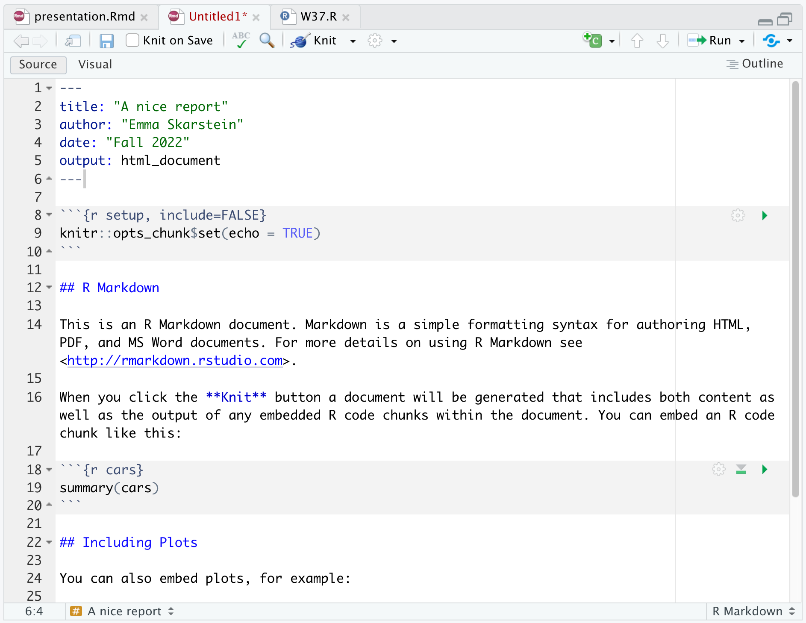
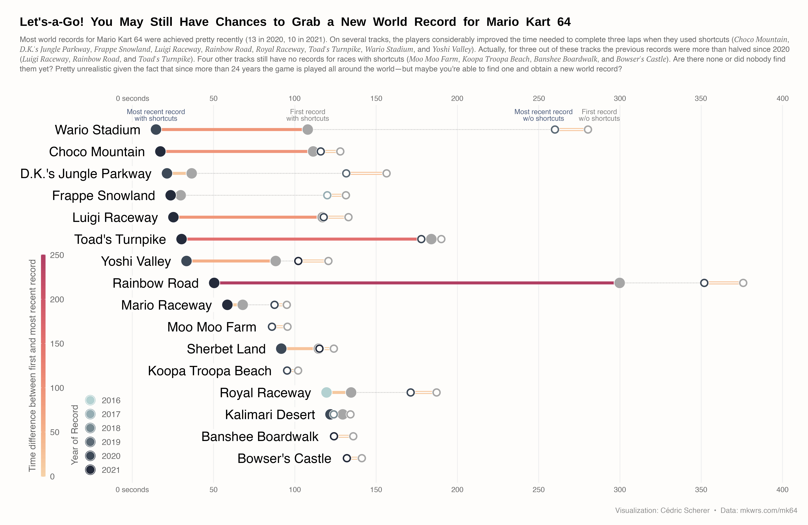

```{r setup, include=FALSE}
options(htmltools.dir.version = FALSE, dpi = 300, warning = FALSE, message = FALSE)
```

```{r xaringan-themer, include=FALSE, warning=FALSE}
library(xaringanthemer)
style_solarized_light()
```

# Goal for today

Two audiences: 
- those of you who just want to get stuff done
- those of you who find joy in exploring new tools

--

Overall

- **Create reproducible reports in _R_ using Rmarkdown**, with a focus on how it can make your life easier when writing reports for assignments.

--

In addition, I will give a short introduction to how to make beautiful plots in ***ggplot2***.


---
class: inverse, center, middle

# Get Started with **R Markdown**

---
# Why R Markdown?

1. R code can be directly integrated in the report
2. Useful for anyone who uses R and wants to communicate results
3. With numerous packages that build on it, it is really easy to create beautiful reports, slides, websites, etc.

**Examples**

- [I made an R Markdown file to explain the code for my **master thesis**](https://htmlpreview.github.io/?https://github.com/emmaSkarstein/Citizen_Science_Skarstein_master/blob/master/reports/Short_version_master.html)
- [**Supplementary material** for academic articles](https://github.com/emmaSkarstein/ISBA2022-Poster/tree/main/Simulation_example)
- [Using R packages and education to scale Data Science at **Airbnb**](https://medium.com/airbnb-engineering/using-r-packages-and-education-to-scale-data-science-at-airbnb-906faa58e12d)
- [These slides!](https://github.com/emmaSkarstein/tma4268_ggplot_rmarkdown)

---
# First steps

Download the `rmarkdown` package:
```{r download-rmarkdown, eval = FALSE}
install.packages("rmarkdown")
```

.pull-left[
Then, in R Studio, click the new-document-button, and choose "R Markdown".

Enter the title you want, and you now have an R Markdown document!
]

.pull-right[
```{r, echo=FALSE, out.width="40%"}
knitr::include_graphics("figs/dropdown.png")
```
]

---
# Try it yourself

Open RStudio and create an R Markdown document.

- Name it whatever you want
- Choose **HTML** to start with
- Knit the document

```{r, echo = FALSE, eval = TRUE}
library(countdown)
countdown(minutes = 1, 
          bottom = 0)
```

---
# Structure of an R Markdown document

.pull-left[
The **YAML** is the part at the top in between "---"

Some things you could add:
- subtitle
- if making a PDF, this is where you could [add LaTeX packages](https://bookdown.org/yihui/rmarkdown-cookbook/latex-extra.html#loading-latex-packages)

**The body** begins with the `setup` chunk, here we can specify global options.

Look at the template: section titles and code chunks
]


.pull-right[

]

---
# Code chunks

.pull-left[
***Lifesaver:*** Shortcut for creating code chunk is 
.small[
- Windows/Linux: **Ctrl+Alt+I**
- macOS: **Command+Option+I**

[You can find more keyboard shortcuts here.](https://bookdown.org/yihui/rmarkdown-cookbook/rstudio-shortcuts.html)
 ]

Note the options in the curly-brackets:
.small[
- `include = FALSE`: code and results will not be shown, but the code will be run.
- `echo = FALSE`: hides the code, but not the results (useful for figures).
- `eval = FALSE`: code is shown, but not run. 
- `message = FALSE`: hides messages generated by code (useful for when loading packages).
- `warning = FALSE`: hides warnings generated by code
- `fig.cap = "..."`: Sets figure caption for figure generated in that chunk
- `out.width="x%"`: Scales the figure size with x%
 ]
]

.pull-right[

Chunk options can be set *globally* in the `setup` chunk if you want them to apply to all code chunks.
]

---
# Try it yourself

- Change the global chunk option `echo` to `FALSE` so that all code is automatically hidden in the report.
- Using `fig.cap="..."`, add a caption to the plot that is included in the template.

```{r, echo = FALSE, eval = TRUE}
library(countdown)
countdown(minutes = 1, 
          bottom = 0)
```

---
# Including formulas

**In-line formula:** `$X \sim Binomial(\lambda)$` becomes $X \sim Binomial(\lambda)$.

**Equation on separate line: **

`$$` `X \sim Binomial(\lambda)$$` becomes

$$
X \sim Binomial(\lambda)
$$
**Equation aligned over several lines: **

Use `\begin{aligned}` and `\end{aligned}`.

`$$`
`\begin{aligned}` ` X &\sim \\ &Binomial(\lambda) \end{aligned}$$` 

becomes
$$\begin{aligned} X &\sim \\ &Binomial(\lambda) \end{aligned}$$


---
# Knitting the document

To create the document, press the **Knit** button.

For courses at NTNU, we generally want you to hand in **PDF** documents, since that lets us view and comment in your file directly in Blackboard. 

[In order to create a PDF document](https://bookdown.org/yihui/rmarkdown-cookbook/install-latex.html), you will need to have a LaTeX distribution installed. One option is TinyTeX, which you can install easily with the R package tinytex:

```{r eval = FALSE}
tinytex::install_tinytex()
```

.pull-left[
**HTML document**

```yaml
---
title: "A nice report"
author: "Emma Skarstein"
date: "Spring 2023"
output: html_document 
---
```
]

.pull-right[
**PDF document**

```yaml
---
title: "A nice report"
author: "Emma Skarstein"
date: "Spring 2023"
output: pdf_document
---
```
]

---
# Automatic tables from R output

[kable](https://cran.r-project.org/web/packages/kableExtra/vignettes/awesome_table_in_html.html) can be used to create nice tables from R output. This can be really useful, because once you have written the code to automatically generate the table from your R output, your table will automatically update once you make changes to your code.

```{r}
library(kableExtra)
some_cars <- mtcars[1:5, 1:6]
```

A basic table:
```{r, eval = FALSE}
kable(some_cars)
```
A prettier table:
```{r, eval = FALSE}
kable(some_cars, booktabs = TRUE)
```

Write `?kable` in *R* for more details of the `kable()` function. 

---
# Try it yourself

- Add a table to the template (feel free to use exactly the code from the previous slide).
- Knit to PDF.
- Find out how to add a caption. .small[(Hint: check `?kable`)]
- If you have time: take a look at the other options in `?kable` and `?kable_styling`.

```{r, echo = FALSE, eval = TRUE}
library(countdown)
countdown(minutes = 2, 
          bottom = 0)
```

---
# Workflow

- As you write code, you can run the code chunks directly **just as you would an R-script**
  - .small[There is both a button to run the individual chunk, and a button to run all the chunks above.]
- When you knit the file, all the code will be run in a blank environment.
- Is the code really slow? Check out [cache options](https://bookdown.org/yihui/rmarkdown-cookbook/cache.html)
- It can be a good idea to knit the document once in a while so you can fix any bugs as they arise. 
- Errors I see a lot: 
  - .small[Using `\begin{align}` instead of `\begin{aligned}` (you can use `align`, but then you need to include the *amsmath* LaTeX package)]
  - .small[Blank lines inside equations will lead to errors.]
- For group collaborations, it is really useful to use GitHub. If you are new to GitHub, I recommend using [GitHub desktop](https://desktop.github.com/), it makes it a lot easier! 
  - .small[Alternatively, you could check out the [`trackdown`](https://bookdown.org/yihui/rmarkdown-cookbook/google-drive.html) package for working in Google Docs, but I haven't tried this myself yet.]

---
# Best practices for this course

(the most important stuff is written in the assignments, but I just want to explain the reasoning behind these things)

- **Knit to PDF** .small[(this is so we can see it directly in Blackboard)]
  - .small[If for some reason you can't, knit to HTML, open the HTML in your browser, select print and then "Save to PDF" from there.]
- **`echo = TRUE` as default** .small[(this may vary from course to course, but in this course we really want to see your code)]
  - .small[Note that other courses may have other preferences on this.]
- **Hand in the PDF file and the `.rmd` file**, *do NOT put them in a .zip file PLEASE!!* .small[(then we need to download it and it is super frustrating and we can't comment in the pdf in Blackboard)]

---
# Resources

You now should know enough to be able to use R Markdown for this course! There are tons of resources out there, and if you have any problems someone has most likely had the same problem before you, so you can solve most issues by googling.

Here are also some resources that cover R Markdown, both the very basic level and some very advanced stuff.


[**R Markdown Cookbook** by Yihui Xie, Christophe Dervieux, Emily Riederer](https://bookdown.org/yihui/rmarkdown-cookbook/)  - has many short, practical examples, I link to several in this presentation!

.pull-left[
[**R Markdown: The Definitive Guide** by Yihui Xie, J. J. Allaire, Garrett Grolemund](https://bookdown.org/yihui/rmarkdown/) - Chapter 2 should be sufficient for this course

[**R Markdown Cheatsheet -->**](https://www.rstudio.com/wp-content/uploads/2015/02/rmarkdown-cheatsheet.pdf) 
]
.pull-right[
```{r, echo=FALSE, out.width="60%"}

```
]


---
# Further opportunities with R Markdown
(Note: This is super optional, and just if you find it fun. You absolutely do not need anything more than the basic report in this course.)

- [Presentation slides](https://rmarkdown.rstudio.com/lesson-11.html) with `beamer`, `ioslides`, `slidy` or others.
  - This presentation was made in R Markdown using [`Xaringan`](https://bookdown.org/yihui/rmarkdown/xaringan.html)

- Basic webpage with [`postcards`](https://github.com/seankross/postcards)

- Websites/blogs with [`Distill`](https://rstudio.github.io/distill/website.html) (can also be combined with `postcards`.)

- Many of templates for paged HTML documents (thesis, CV, poster, etc.) with [`pagedown`](https://github.com/rstudio/pagedown) 

- NEW: You may also be interested in **Quarto**, the next generation of R Markdown. It works very similar to R Markdown, but you can use it for Python and Julia as well. 


---
class: inverse, center, middle

# Get Started with `ggplot2`

---
# Why `ggplot2`?

- It gives you a recognizable system - when you have understood the structure of `ggplot2` it is very easy to understand how to modify things to get exactly the plot you want. 
- When you have learned how to tweak the layout it is really easy to create your own style.

Example: [(here is a tutorial)](https://r-graph-gallery.com/web-lollipop-plot-with-r-mario-kart-64-world-records.html)

```{r, echo=FALSE, out.width="60%"}

```

---
# The components of ggplot2

|                 |                                    |
| --------------- | ---------------------------------- |
| `ggplot(data)`  | The **data** that you want to build your graphic on. |
| `aes()`         | **Aesthetic mappings** between your data and visual properties of your graphic. |
| `geom_*()`      | The **geometric shapes** representing the data. |


```{r, eval = FALSE}
ggplot(data, aes(x = ..., y = ..., color = ...)) +
  geom_*()
```


---
# First steps

Install the `ggplot2` package:

```{r, eval = FALSE}
install.packages("ggplot2")
```

Load the package:

```{r}
library(ggplot2)
```

For this tutorial, I'll use the `palmerpenguins` dataset, which you can install and load in the same way:

```{r eval = FALSE}
install.packages("palmerpenguins")
```
```{r}
library(palmerpenguins)
```

---
# A simple plot

Let's first take a look at the structure of our data.

```{r}
head(penguins)
```


```{r}
names(penguins)
```

---
# A simple plot

```{r, eval = FALSE}
ggplot(data = penguins, 
       aes(x = flipper_length_mm, y = body_mass_g))
```
.pull-left[
```{r, echo = FALSE, out.width="90%"}
ggplot(data = penguins, 
       aes(x = flipper_length_mm, y = body_mass_g))
```
]
.pull-right[
Let's say we want to plot the flipper length against body mass. We use the `ggplot()` function, and specify the data set, and what we want on the x- and y-axis. If we run this, we see the initialized plot.
]

---
# A simple plot - Adding points

```{r eval = FALSE}
ggplot(data = penguins, 
       aes(x = flipper_length_mm, y = body_mass_g)) +
  geom_point() #<<
```

.pull-left[
```{r echo = FALSE, warning = FALSE, out.width="90%"}
ggplot(data = penguins, 
       aes(x = flipper_length_mm, y = body_mass_g)) +
  geom_point()
```
]

.pull-right[
To get the actual data on the plot, we need to specify `geom_point()`. The layers of a `ggplot` are added together with a **`+`**. 
]

---
# A simple plot - Color by species

```{r eval = FALSE}
ggplot(data = penguins, 
       aes(x = flipper_length_mm, y = body_mass_g)) +
  geom_point(aes(color = species)) #<<
```

.pull-left[
```{r echo = FALSE, warning = FALSE, out.width="90%"}
ggplot(data = penguins, 
       aes(x = flipper_length_mm, y = body_mass_g)) +
  geom_point(aes(color = species)) #<<
```
]

.pull-right[
To color the points by species, add `aes(color = species)` inside `geom_point()`. 
]

---
# A simple plot - Themes

```{r eval = FALSE}
ggplot(data = penguins, 
       aes(x = flipper_length_mm, y = body_mass_g)) +
  geom_point(aes(color = species)) +
  theme_bw() #<<
```

.pull-left[
```{r echo = FALSE, warning = FALSE, out.width="90%"}
ggplot(data = penguins, 
       aes(x = flipper_length_mm, y = body_mass_g)) +
  geom_point(aes(color = species)) +
  theme_bw() #<<
```
]

.pull-right[
We can make changes to the layout of the plot by specifying a different theme. The default is `theme_gray()`, let's change it to `theme_bw()`. 
]

---
# A simple plot - Color palettes

```{r eval = FALSE}
ggplot(data = penguins, 
       aes(x = flipper_length_mm, y = body_mass_g)) +
  geom_point(aes(color = species)) +
  scale_color_manual(values = c("orange", "darkcyan", "hotpink")) + #<<
  theme_bw() 
```

.pull-left[
```{r echo = FALSE, warning = FALSE, out.width="90%"}
ggplot(data = penguins, 
       aes(x = flipper_length_mm, y = body_mass_g)) +
  geom_point(aes(color = species)) +
  scale_color_manual(values = c("orange", "darkcyan", "hotpink")) + #<<
  theme_bw() 
```
]

.pull-right[
The color palette can be changed through `scale_color_...()`. In this case, we want to specify manual values for the colors, but you could also use ready-made color palettes, [there are lots of them!](https://emilhvitfeldt.github.io/r-color-palettes/discrete.html)
]

---
# A simple plot - Theme options

```{r eval = FALSE}
ggplot(data = penguins, 
       aes(x = flipper_length_mm, y = body_mass_g)) +
  geom_point(aes(color = species)) +
  scale_color_manual(values = c("orange", "darkcyan", "hotpink")) +
  theme_bw() +
  theme(legend.position = "top") #<<
```

.pull-left[
```{r echo = FALSE, warning = FALSE, out.width="90%"}
ggplot(data = penguins, 
       aes(x = flipper_length_mm, y = body_mass_g)) +
  geom_point(aes(color = species)) +
  scale_color_manual(values = c("orange", "darkcyan", "hotpink")) +
  theme_bw() +
  theme(legend.position = "top") #<<
```
]

.pull-right[
In the `theme()` function you can change stuff like background color, font, text sizes and colors, and much more, basically anything that has to do with the layout. There we move the legend to be on the top.
]

---
# A simple plot - Axis and legend titles

```{r eval = FALSE}
ggplot(data = penguins, 
       aes(x = flipper_length_mm, y = body_mass_g)) +
  geom_point(aes(color = species)) +
  scale_color_manual(values = c("orange", "darkcyan", "hotpink")) +
  labs(color = "Species", #<<
       x = "Flipper length (mm)", y = "Body mass (g)") + #<<
  theme_bw() +
  theme(legend.position = "top")
```

.pull-left[
```{r echo = FALSE, warning = FALSE, out.width="60%"}
ggplot(data = penguins, 
       aes(x = flipper_length_mm, y = body_mass_g)) +
  geom_point(aes(color = species)) +
  scale_color_manual(values = c("orange", "darkcyan", "hotpink")) +
  labs(color = "Species", #<<
       x = "Flipper length (mm)", y = "Body mass (g)") + #<<
  theme_bw() +
  theme(legend.position = "top")
```
]

.pull-right[
We can change the axis and legend titles by using `labs()`. The reason we specify `color = "Species"` is that we want the legend for color to have this title. `labs()` is also where you can add a title, subtitle and caption.
]

---

# A simple plot - Fonts

```{r echo = FALSE, message = FALSE, warning = FALSE}
library(showtext)
font_add_google(name = "Josefin Sans", family = "Josefin Sans")
```

```{r eval = FALSE, message = FALSE, warning = FALSE}
library(showtext)
showtext_auto()
font_add_google(name = "Josefin Sans", family = "Josefin Sans")
```

The package `showtext` is great for changing fonts. You can change the font to any font from [Google Fonts](https://fonts.google.com/).

---

# A simple plot - Fonts

```{r eval = FALSE}
ggplot(data = penguins, 
       aes(x = flipper_length_mm, y = body_mass_g)) +
  geom_point(aes(color = species)) +
  scale_color_manual(values = c("orange", "darkcyan", "hotpink")) +
  labs(color = "Species", 
       x = "Flipper length (mm)", y = "Body mass (g)") + 
  theme_bw() +
  theme(legend.position = "top",
        text = element_text(family = "Josefin Sans")) #<<
```

.pull-left[
```{r echo = FALSE, message = FALSE, warning = FALSE, out.width="60%"}
ggplot(data = penguins, 
       aes(x = flipper_length_mm, y = body_mass_g)) +
  geom_point(aes(color = species)) +
  scale_color_manual(values = c("orange", "darkcyan", "hotpink")) +
  labs(color = "Species", 
       x = "Flipper length (mm)", y = "Body mass (g)") + 
  theme_bw() +
  theme(legend.position = "top",
        text = element_text(family = "Josefin Sans")) #<<
```
]

.pull-right[
I used Josefin Sans here to make the change obvious. A nice go-to font is Open Sans.
]

---
# Final penguin figure

```{r echo = FALSE, message = FALSE, warning = FALSE, out.width="60%"}
ggplot(data = penguins, 
       aes(x = flipper_length_mm, y = body_mass_g)) +
  geom_point(aes(color = species)) +
  scale_color_manual(values = c("orange", "darkcyan", "hotpink")) +
  labs(color = "Species", 
       x = "Flipper length (mm)", y = "Body mass (g)") + 
  theme_bw() +
  theme(legend.position = "top",
        text = element_text(family = "Josefin Sans")) #<<
```

---
# More penguin plots

You can see some more examples of `ggplot2` plots with the `palmerpenguin` data [here](https://allisonhorst.github.io/palmerpenguins/articles/examples.html).


---
# **ggplot2** resources

- [The R graph gallery](https://r-graph-gallery.com/): different graphs in base R and ggplot2, many examples and tutorials.

- [ggplot2 cheatsheet](https://raw.githubusercontent.com/rstudio/cheatsheets/main/data-visualization.pdf)

- Tutorial by Cédric Scherer, ["Graphic design with ggplot2"](https://www.cedricscherer.com/2019/08/05/a-ggplot2-tutorial-for-beautiful-plotting-in-r/) 
  - .small[A really great reference, goes into _great_ detail of all the options of ggplot2]


---

class: center, middle

Thank you for your attention, I hope this is helpful. If you have any questions, go ahead and ask in the forum, I would love to help!

You can see the "solution" to the "Try it yourself" exercises [here](https://github.com/emmaSkarstein/tma4268_ggplot_rmarkdown/blob/master/nice_report.Rmd).

Slides created via the R package [`xaringan`](https://github.com/yihui/xaringan), all code is available [on GitHub](https://github.com/emmaSkarstein/tma4268_ggplot_rmarkdown).


